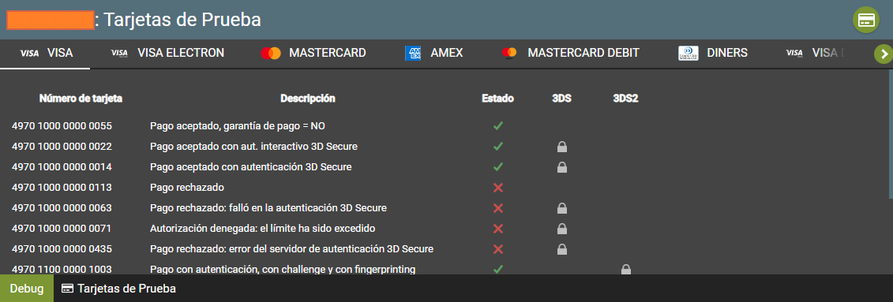

# Embedded-PaymentForm-Java

Ejemplo de un formulario incrustado en JAVA, para poder ejecutar el siguiente ejemplo seguir los pasos del presente manual.

Recordemos que al usar JAVA es muy beneficioso ya que es multiplataforma y al desarrollar una aplicación, esta podrá ser utilizada en cualquier sistema operativo sea Windows, Mac o Linux

<p align="center">
  
</p> 

## Este es un ejemplo de como poder integrar un formulario embebido utilizando el lenguaje de programción Java. Este ejemplo es solo una guía para poder realizar la integración de la pasarela de pagos, puede realizar las modificaciones necesarias para su proyecto.

<a name="Requisitos_Previos"></a>

## Requisitos Previos

* Acceso al Back Office Vendedor (BOV) y Claves de autenticación. [Guía Aquí](https://github.com/izipay-pe/obtener-credenciales-de-conexion)
* Servidor web o servidor local.
* Java 7 o superior

## 1.- Crear el proyecto

Descargar el proyecto .zip haciendo click [Aquí](https://github.com/izipay-pe/Embedded-PaymentFormT1-Java/archive/refs/heads/main.zip) o clonarlo desde Git.
```sh
git clone https://github.com/izipay-pe/Embedded-PaymentFormT1-Java.git
``` 

Crearse una cuenta gratuita en 000webhost y subir el proyecto a la carpeta raiz del hosting public_html/ (Ya sea por el administrador de archivos o filezilla)

Crearse un nuevo sitio.
Seleccionar Administrar sitio web.
Selccionar File Manager y luego Upload Files

## 2.- Configurar datos de conexión

La información la puede obtener desde su Back Office Vendedor (Configuración --> Tienda --> Claves)

Editar el archivo `config.properties`

```sh
// Identificador de su tienda
site_id=12345678

// Clave de Test
key_test=XXXXXXXXXXXXXXXXXXX

// Clave de Producción
key_prod=XXXXXXXXXXXXXXXXXXX

// Método

return_mode=POST

// URL del servidor de Izipay
gateway_url=https://api.micuentaweb.pe
``` 

## 3.- Transacción de prueba

El formulario de pago está listo, puede intentar realizar una transacción utilizando una tarjeta de prueba con la barra de herramientas de depuración (en la parte inferior de la página).

  

Para obtener más información, eche un vistazo a:

- [Formulario incrustado: prueba rápida](https://secure.micuentaweb.pe/doc/es-PE/rest/V4.0/javascript/quick_start_js.html).
- [Primeros pasos: pago simple](https://secure.micuentaweb.pe/doc/es-PE/rest/V4.0/javascript/guide/start.html).
- [Servicios web - referencia de la API REST](https://secure.micuentaweb.pe/doc/es-PE/rest/V4.0/api/reference.html).

NOTA: 

1.- Paso de la tienda al modo PRODUCTION 

     Modifique su implementación para utilizar Incrustado:
     * la contraseña de producción,
     * clave pública de producción,
     * la clave HMAC-SHA-256 de producción para calcular la firma contenida en el campo kr-hash.
     * Ingrese correctamente la URL de notificación al final del pago en modo PRODUCTION en el menú Configuración > Reglas de notificación .

2.- No tengo una cuenta activa con Izipay. [Suscribete Aquí](https://online.izipay.pe/comprar/cliente)

   | CARACTERÍSTICAS | VALOR |
   | ------------- | ------------- |
   | Usuario de prueba  | 89289758  |
   | Contraseña de prueba  | testpassword_7vAtvN49E8Ad6e6ihMqIOvOHC6QV5YKmIXgxisMm0V7Eq  |
   | Clave pública de prueba  | 89289758:testpublickey_TxzPjl9xKlhM0a6tfSVNilcLTOUZ0ndsTogGTByPUATcE  |
   | Clave HMAC SHA256 de prueba  | fva7JZ2vSY7MhRuOPamu6U5HlpabAoEf8VmFHQupspnXB  |
   | URL de base  | https://api.micuentaweb.pe |
   | URL para el cliente JavaScript | https://static.micuentaweb.pe/static/js/krypton-client/V4.0/stable/kr-payment-form.min.js  |

## 4.- Implementar IPN

IPN son las siglas de Instant Payment Notification (URL de notificación instantánea, en inglés). Al crear una transacción o cambiar su estado, nuestros servidores emitirán una IPN que llamará a una URL de notificación en sus servidores. Esto le permitirá estar informado en tiempo real de los cambios realizados en una transacción.

Las IPN son la única manera de recibir notificaciones en los casos siguientes:

* La conexión a Internet del comprador se ha cortado.
* El comprador cierra su navegador durante el pago.
* Se ha rechazado una transacción.
* El comprador no ha terminado su pago antes de la expiración de su sesión de pago.

Por lo tanto, es obligatorio integrar las IPN.

<p align="center">
  
</p>  

* Ver manual de implementacion de la IPN [Aquí](https://secure.micuentaweb.pe/doc/es-PE/rest/V4.0/kb/payment_done.html).

* Ver el ejemplo de la respuesta IPN con PHP [Aquí](https://github.com/izipay-pe/Redirect-PaymentForm-IpnT1-PHP).

* Ver el ejemplo de la respuesta IPN con NODE.JS [Aquí](https://github.com/izipay-pe/Response-PaymentFormT1-Ipn).

